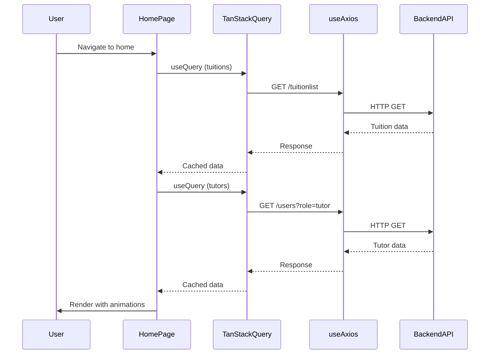

# Design Document: Home Page Enhancements

## Overview

This design enhances the existing Home page with four key features: a prominent hero section, a dynamic Latest Tuition Posts section, a dynamic Latest Tutors section, and Framer Motion animations throughout. The implementation leverages the existing React + Vite architecture, Tailwind CSS + DaisyUI styling, TanStack Query for data fetching, and introduces Framer Motion for smooth animations. All dynamic sections fetch data from the backend API using the existing axios hooks (useAxios/useAxiosSecure).

## Architecture

```mermaid
graph TD
    A[Home Page] --> B[Hero Section]
    A --> C[Latest Tuition Posts]
    A --> D[Latest Tutors]
    A --> E[Existing Banner]
    A --> F[Existing ScrollButtons]
    
    C --> G[useAxios Hook]
    D --> G
    
    G --> H[Backend API]
    H --> I[/tuitionlist endpoint]
    H --> J[/users endpoint]
    
    B --> K[Framer Motion]
    C --> K
    D --> K
    
    style A fill:#e1f5ff
    style K fill:#ffe1f5
```

## Sequence Diagrams

### Data Fetching Flow



## Components and Interfaces

### Component 1: HeroSection

**Purpose**: Display a prominent hero section with call-to-action buttons and animated content

**Interface**:
```typescript
interface HeroSectionProps {
  // No props needed - self-contained component
}

const HeroSection: React.FC<HeroSectionProps> = () => {
  // Component implementation
}
```

**Responsibilities**:
- Display hero heading and subheading
- Render call-to-action buttons (Browse Tuitions, Become a Tutor)
- Apply Framer Motion entrance animations
- Navigate to appropriate routes on button clicks

**Animation Strategy**:
- Fade in + slide up animation for heading
- Staggered animation for buttons

### Component 2: LatestTuitionPosts

**Purpose**: Fetch and display the 6 most recent tuition posts with animations

**Interface**:
```typescript
interface TuitionPost {
  _id: string;
  NameOfclass: string;
  subjectName: string;
  tuitionDistrict: string;
  createdAt?: string;
}

interface LatestTuitionPostsProps {
  limit?: number; // Default: 6
}

const LatestTuitionPosts: React.FC<LatestTuitionPostsProps> = ({ limit = 6 }) => {
  // Component implementation
}
```

**Responsibilities**:
- Fetch tuition posts from `/tuitionlist` endpoint
- Sort by creation date (most recent first)
- Display limited number of posts (default 6)
- Apply Framer Motion stagger animations to cards
- Handle loading and error states
- Navigate to tuition details on card click

**Animation Strategy**:
- Container with stagger children animation
- Each card fades in + scales up sequentially

### Component 3: LatestTutors

**Purpose**: Fetch and display the 6 most recent tutors with animations

**Interface**:
```typescript
interface Tutor {
  _id: string;
  displayName: string;
  email: string;
  photoURL: string;
  role: 'tutor';
  createdAt?: string;
  mobile?: string;
}

interface LatestTutorsProps {
  limit?: number; // Default: 6
}

const LatestTutors: React.FC<LatestTutorsProps> = ({ limit = 6 }) => {
  // Component implementation
}
```

**Responsibilities**:
- Fetch tutors from `/users?role=tutor` endpoint
- Sort by creation date (most recent first)
- Display limited number of tutors (default 6)
- Apply Framer Motion stagger animations to cards
- Handle loading and error states
- Display tutor avatar, name, and contact info

**Animation Strategy**:
- Container with stagger children animation
- Each card fades in + slides from left sequentially

### Component 4: Enhanced Home Page

**Purpose**: Orchestrate all home page sections with proper layout

**Interface**:
```typescript
const Home: React.FC = () => {
  // Component implementation
}
```

**Responsibilities**:
- Render HeroSection at the top
- Render LatestTuitionPosts section
- Render LatestTutors section
- Maintain existing Banner and ScrollButtons
- Apply consistent spacing and layout

## Data Models

### TuitionPost Model

```typescript
interface TuitionPost {
  _id: string;
  NameOfclass: string;
  subjectName: string;
  tuitionDistrict: string;
  createdAt?: string;
  // Additional fields from backend
  tuitionArea?: string;
  salary?: number;
  selectedDays?: string[];
  tuitionTime?: string;
  studentGender?: string;
  tutorGender?: string;
  numberOfStudents?: number;
  extraInfo?: string;
  studentEmail?: string;
}
```

**Validation Rules**:
- `_id` must be non-empty string
- `NameOfclass` must be non-empty string
- `subjectName` must be non-empty string
- `tuitionDistrict` must be non-empty string

### Tutor Model

```typescript
interface Tutor {
  _id: string;
  displayName: string;
  email: string;
  photoURL: string;
  role: 'tutor';
  createdAt?: string;
  mobile?: string;
  // Additional fields
  address?: string;
  district?: string;
}
```

**Validation Rules**:
- `_id` must be non-empty string
- `displayName` must be non-empty string
- `email` must be valid email format
- `photoURL` must be valid URL or empty string
- `role` must equal 'tutor'

## Algorithmic Pseudocode

### Main Data Fetching Algorithm

```typescript
// Algorithm: Fetch Latest Tuition Posts
function fetchLatestTuitionPosts(limit: number): TuitionPost[] {
  // Preconditions:
  // - limit > 0
  // - API endpoint /tuitionlist is available
  
  const axiosInstance = useAxios();
  
  const { data, isLoading, isError } = useQuery({
    queryKey: ['latest-tuitions', limit],
    queryFn: async () => {
      const response = await axiosInstance.get('/tuitionlist');
      return response.data;
    },
    staleTime: 5 * 60 * 1000, // 5 minutes
  });
  
  if (isLoading) return [];
  if (isError) return [];
  
  // Sort by createdAt descending (most recent first)
  const sorted = data.sort((a, b) => {
    const dateA = new Date(a.createdAt || 0).getTime();
    const dateB = new Date(b.createdAt || 0).getTime();
    return dateB - dateA;
  });
  
  // Return limited results
  return sorted.slice(0, limit);
  
  // Postconditions:
  // - Returns array of TuitionPost objects
  // - Array length <= limit
  // - Array is sorted by createdAt descending
}
```

```typescript
// Algorithm: Fetch Latest Tutors
function fetchLatestTutors(limit: number): Tutor[] {
  // Preconditions:
  // - limit > 0
  // - API endpoint /users is available
  
  const axiosInstance = useAxios();
  
  const { data, isLoading, isError } = useQuery({
    queryKey: ['latest-tutors', limit],
    queryFn: async () => {
      const response = await axiosInstance.get('/users', {
        params: { role: 'tutor' }
      });
      return response.data;
    },
    staleTime: 5 * 60 * 1000, // 5 minutes
  });
  
  if (isLoading) return [];
  if (isError) return [];
  
  // Sort by createdAt descending (most recent first)
  const sorted = data.sort((a, b) => {
    const dateA = new Date(a.createdAt || 0).getTime();
    const dateB = new Date(b.createdAt || 0).getTime();
    return dateB - dateA;
  });
  
  // Return limited results
  return sorted.slice(0, limit);
  
  // Postconditions:
  // - Returns array of Tutor objects
  // - Array length <= limit
  // - Array is sorted by createdAt descending
  // - All items have role === 'tutor'
}
```

### Animation Configuration Algorithm

```typescript
// Algorithm: Configure Framer Motion Animations
function getAnimationVariants() {
  // Container animation for stagger effect
  const containerVariants = {
    hidden: { opacity: 0 },
    visible: {
      opacity: 1,
      transition: {
        staggerChildren: 0.1, // 100ms delay between children
        delayChildren: 0.2,   // 200ms delay before first child
      }
    }
  };
  
  // Card animation for individual items
  const cardVariants = {
    hidden: { 
      opacity: 0, 
      y: 20,
      scale: 0.95
    },
    visible: { 
      opacity: 1, 
      y: 0,
      scale: 1,
      transition: {
        duration: 0.5,
        ease: "easeOut"
      }
    }
  };
  
  // Hero animation for main heading
  const heroVariants = {
    hidden: { 
      opacity: 0, 
      y: -30
    },
    visible: { 
      opacity: 1, 
      y: 0,
      transition: {
        duration: 0.8,
        ease: "easeOut"
      }
    }
  };
  
  return { containerVariants, cardVariants, heroVariants };
  
  // Postconditions:
  // - Returns object with three variant configurations
  // - All variants have hidden and visible states
  // - Timing values are positive numbers
}
```

## Key Functions with Formal Specifications

### Function 1: sortByCreatedDate()

```typescript
function sortByCreatedDate<T extends { createdAt?: string }>(
  items: T[], 
  order: 'asc' | 'desc' = 'desc'
): T[]
```

**Preconditions:**
- `items` is a valid array (may be empty)
- Each item may have optional `createdAt` string field
- `order` is either 'asc' or 'desc'

**Postconditions:**
- Returns new sorted array (does not mutate input)
- Items without `createdAt` are treated as oldest (epoch 0)
- If `order === 'desc'`, most recent items appear first
- If `order === 'asc'`, oldest items appear first
- Original array remains unchanged

**Loop Invariants:** N/A (uses built-in sort)

### Function 2: limitResults()

```typescript
function limitResults<T>(items: T[], limit: number): T[]
```

**Preconditions:**
- `items` is a valid array
- `limit` is a positive integer

**Postconditions:**
- Returns array with length <= limit
- Returns first `limit` items from input array
- If `items.length <= limit`, returns all items
- Original array remains unchanged

**Loop Invariants:** N/A (uses array slice)

### Function 3: handleNavigateToDetails()

```typescript
function handleNavigateToDetails(id: string, type: 'tuition' | 'tutor'): void
```

**Preconditions:**
- `id` is non-empty string
- `type` is either 'tuition' or 'tutor'
- React Router navigate function is available

**Postconditions:**
- Navigates to appropriate detail page
- If `type === 'tuition'`, navigates to `/tuition-details/${id}`
- If `type === 'tutor'`, navigates to `/tutor-profile/${id}` (or appropriate route)
- No side effects on component state

**Loop Invariants:** N/A

## Example Usage

### HeroSection Component

```typescript
import { motion } from 'framer-motion';
import { useNavigate } from 'react-router';

const HeroSection: React.FC = () => {
  const navigate = useNavigate();
  
  const heroVariants = {
    hidden: { opacity: 0, y: -30 },
    visible: { 
      opacity: 1, 
      y: 0,
      transition: { duration: 0.8, ease: "easeOut" }
    }
  };
  
  return (
    <motion.div
      className="hero min-h-[500px] bg-gradient-to-r from-blue-500 to-purple-600"
      initial="hidden"
      animate="visible"
      variants={heroVariants}
    >
      <div className="hero-content text-center text-white">
        <div className="max-w-md">
          <h1 className="text-5xl font-bold mb-4">
            Find Your Perfect Tutor
          </h1>
          <p className="text-lg mb-6">
            Connect with qualified tutors for personalized learning experiences
          </p>
          <div className="flex gap-4 justify-center">
            <button 
              className="btn btn-primary"
              onClick={() => navigate('/tuition-list')}
            >
              Browse Tuitions
            </button>
            <button 
              className="btn btn-secondary"
              onClick={() => navigate('/register')}
            >
              Become a Tutor
            </button>
          </div>
        </div>
      </div>
    </motion.div>
  );
};
```

### LatestTuitionPosts Component

```typescript
import { motion } from 'framer-motion';
import { useQuery } from '@tanstack/react-query';
import { useNavigate } from 'react-router';
import useAxios from '../../hooks/useAxios';

const LatestTuitionPosts: React.FC<{ limit?: number }> = ({ limit = 6 }) => {
  const axiosInstance = useAxios();
  const navigate = useNavigate();
  
  const { data: tuitions = [], isLoading } = useQuery({
    queryKey: ['latest-tuitions', limit],
    queryFn: async () => {
      const res = await axiosInstance.get('/tuitionlist');
      const sorted = res.data.sort((a, b) => 
        new Date(b.createdAt || 0).getTime() - new Date(a.createdAt || 0).getTime()
      );
      return sorted.slice(0, limit);
    },
  });
  
  const containerVariants = {
    hidden: { opacity: 0 },
    visible: {
      opacity: 1,
      transition: { staggerChildren: 0.1, delayChildren: 0.2 }
    }
  };
  
  const cardVariants = {
    hidden: { opacity: 0, y: 20, scale: 0.95 },
    visible: { 
      opacity: 1, 
      y: 0, 
      scale: 1,
      transition: { duration: 0.5, ease: "easeOut" }
    }
  };
  
  if (isLoading) return <div>Loading...</div>;
  
  return (
    <section className="py-12">
      <h2 className="text-4xl font-bold text-center mb-8">
        Latest Tuition Posts
      </h2>
      <motion.div
        className="grid md:grid-cols-2 lg:grid-cols-3 gap-6"
        variants={containerVariants}
        initial="hidden"
        animate="visible"
      >
        {tuitions.map((tuition) => (
          <motion.div
            key={tuition._id}
            variants={cardVariants}
            className="card bg-base-100 shadow-xl cursor-pointer hover:shadow-2xl transition"
            onClick={() => navigate(`/tuition-details/${tuition._id}`)}
          >
            <div className="card-body">
              <h3 className="card-title">{tuition.NameOfclass}</h3>
              <p>Subject: {tuition.subjectName}</p>
              <p>District: {tuition.tuitionDistrict}</p>
            </div>
          </motion.div>
        ))}
      </motion.div>
    </section>
  );
};
```

### LatestTutors Component

```typescript
import { motion } from 'framer-motion';
import { useQuery } from '@tanstack/react-query';
import useAxios from '../../hooks/useAxios';

const LatestTutors: React.FC<{ limit?: number }> = ({ limit = 6 }) => {
  const axiosInstance = useAxios();
  
  const { data: tutors = [], isLoading } = useQuery({
    queryKey: ['latest-tutors', limit],
    queryFn: async () => {
      const res = await axiosInstance.get('/users', {
        params: { role: 'tutor' }
      });
      const sorted = res.data.sort((a, b) => 
        new Date(b.createdAt || 0).getTime() - new Date(a.createdAt || 0).getTime()
      );
      return sorted.slice(0, limit);
    },
  });
  
  const containerVariants = {
    hidden: { opacity: 0 },
    visible: {
      opacity: 1,
      transition: { staggerChildren: 0.1, delayChildren: 0.2 }
    }
  };
  
  const cardVariants = {
    hidden: { opacity: 0, x: -20 },
    visible: { 
      opacity: 1, 
      x: 0,
      transition: { duration: 0.5, ease: "easeOut" }
    }
  };
  
  if (isLoading) return <div>Loading...</div>;
  
  return (
    <section className="py-12">
      <h2 className="text-4xl font-bold text-center mb-8">
        Latest Tutors
      </h2>
      <motion.div
        className="grid md:grid-cols-2 lg:grid-cols-3 gap-6"
        variants={containerVariants}
        initial="hidden"
        animate="visible"
      >
        {tutors.map((tutor) => (
          <motion.div
            key={tutor._id}
            variants={cardVariants}
            className="card bg-base-100 shadow-xl"
          >
            <figure className="px-10 pt-10">
              
            </figure>
            <div className="card-body items-center text-center">
              <h3 className="card-title">{tutor.displayName}</h3>
              <p>{tutor.email}</p>
              {tutor.mobile && <p>📞 {tutor.mobile}</p>}
            </div>
          </motion.div>
        ))}
      </motion.div>
    </section>
  );
};
```

### Enhanced Home Page

```typescript
import React from 'react';
import Banner from './Banner';
import ScrollButtons from './ScrollButtons';
import HeroSection from './HeroSection';
import LatestTuitionPosts from './LatestTuitionPosts';
import LatestTutors from './LatestTutors';

const Home: React.FC = () => {
  return (
    <div className="xl:w-9/12 mx-auto">
      <HeroSection />
      <Banner />
      <LatestTuitionPosts limit={6} />
      <LatestTutors limit={6} />
      <ScrollButtons />
    </div>
  );
};

export default Home;
```

## Correctness Properties

*A property is a characteristic or behavior that should hold true across all valid executions of a system—essentially, a formal statement about what the system should do. Properties serve as the bridge between human-readable specifications and machine-verifiable correctness guarantees.*

### Property 1: Descending Date Sort Order

*For any* array of items with creation dates, when sorted in descending order, each item should have a creation date greater than or equal to the next item in the array.

**Validates: Requirements 2.2, 4.2, 6.1**

### Property 2: Result Limiting

*For any* array of items and positive integer limit, the limited result should contain at most the specified limit number of items.

**Validates: Requirements 2.3, 4.3, 6.3**

### Property 3: Tuition Post Display Completeness

*For any* tuition post, when rendered, the display should include the class name, subject name, and district.

**Validates: Requirements 3.3, 3.4, 3.5**

### Property 4: Tutor Display Completeness

*For any* tutor, when rendered, the display should include the profile photo, display name, and email address.

**Validates: Requirements 5.3, 5.4, 5.5**

### Property 5: Conditional Mobile Display

*For any* tutor with a mobile number field, when rendered, the display should include the mobile number.

**Validates: Requirements 5.6**

### Property 6: Navigation Correctness

*For any* tuition post, when clicked, the system should navigate to the tuition details page with the correct tuition ID.

**Validates: Requirements 3.6**

### Property 7: Data Immutability

*For any* data array, when sorting or limiting operations are applied, the original array should remain unchanged.

**Validates: Requirements 6.5**

### Property 8: Role Filtering

*For any* user returned by the tutor fetching function, the user's role should equal 'tutor'.

**Validates: Requirements 8.2, 8.3, 11.8**

### Property 9: Tuition Post Validation

*For any* tuition post received from the API, the post should have non-empty string values for `_id`, `NameOfclass`, `subjectName`, and `tuitionDistrict` fields.

**Validates: Requirements 11.1, 11.2, 11.3, 11.4**

### Property 10: Tutor Validation

*For any* tutor received from the API, the tutor should have a non-empty string `_id`, a non-empty string `displayName`, a valid email format for `email`, and role equal to 'tutor'.

**Validates: Requirements 11.5, 11.6, 11.7, 11.8**

## Error Handling

### Error Scenario 1: API Fetch Failure

**Condition**: Backend API is unavailable or returns error
**Response**: 
- TanStack Query catches the error
- Component receives `isError: true` state
- Display user-friendly error message or empty state
**Recovery**: 
- TanStack Query automatically retries (default 3 times)
- User can manually refresh the page
- Cached data is served if available

### Error Scenario 2: Missing createdAt Field

**Condition**: Tuition or tutor data lacks `createdAt` field
**Response**: 
- Treat missing `createdAt` as epoch 0 (oldest possible date)
- Item appears at end of sorted list
**Recovery**: 
- No recovery needed - graceful degradation
- Items still display correctly, just not in perfect chronological order

### Error Scenario 3: Invalid Data Structure

**Condition**: API returns data with unexpected structure
**Response**: 
- TypeScript type checking catches issues at compile time
- Runtime: Display error boundary or fallback UI
**Recovery**: 
- Log error to console for debugging
- Display "Unable to load data" message
- Provide retry button

### Error Scenario 4: Framer Motion Not Loaded

**Condition**: Framer Motion library fails to load
**Response**: 
- Components render without animations
- Fallback to standard React rendering
**Recovery**: 
- Check network connection
- Reload page to retry loading library

## Testing Strategy

### Unit Testing Approach

Test individual utility functions and data transformations:
- `sortByCreatedDate()` function with various input arrays
- `limitResults()` function with different limits
- Animation variant configurations
- Data model validation functions

**Key Test Cases**:
1. Sort empty array → returns empty array
2. Sort array with missing `createdAt` → items with dates come first
3. Limit results with limit > array length → returns all items
4. Limit results with limit < array length → returns exactly limit items

### Property-Based Testing Approach

**Property Test Library**: fast-check (for JavaScript/TypeScript)

**Properties to Test**:
1. **Idempotence**: Sorting twice produces same result
2. **Limit Boundary**: Result length never exceeds limit
3. **Order Preservation**: Sorted array maintains descending order
4. **Role Filtering**: All tutors have role === 'tutor'

**Example Property Test**:
```typescript
import fc from 'fast-check';

test('sortByCreatedDate maintains descending order', () => {
  fc.assert(
    fc.property(
      fc.array(fc.record({
        _id: fc.string(),
        createdAt: fc.date().map(d => d.toISOString())
      })),
      (items) => {
        const sorted = sortByCreatedDate(items, 'desc');
        for (let i = 0; i < sorted.length - 1; i++) {
          const dateA = new Date(sorted[i].createdAt).getTime();
          const dateB = new Date(sorted[i + 1].createdAt).getTime();
          expect(dateA).toBeGreaterThanOrEqual(dateB);
        }
      }
    )
  );
});
```

### Integration Testing Approach

Test component interactions with API and rendering:
- Mock API responses using MSW (Mock Service Worker)
- Test data fetching with TanStack Query
- Verify correct rendering of fetched data
- Test navigation on card clicks
- Verify animations trigger correctly

**Key Integration Tests**:
1. LatestTuitionPosts fetches and displays data
2. LatestTutors fetches and displays data
3. HeroSection buttons navigate correctly
4. Loading states display during fetch
5. Error states display on fetch failure

## Performance Considerations

### Data Fetching Optimization
- Use TanStack Query caching (5-minute stale time)
- Fetch only necessary data (limit to 6 items per section)
- Consider pagination for future scalability

### Animation Performance
- Use Framer Motion's hardware-accelerated transforms
- Limit number of simultaneously animating elements
- Use `will-change` CSS property sparingly
- Stagger animations to avoid overwhelming the browser

### Image Optimization
- Lazy load tutor profile images
- Use appropriate image sizes (avoid loading full-resolution images)
- Consider using Next.js Image component for future optimization

### Bundle Size
- Framer Motion adds ~30KB gzipped
- Tree-shake unused Framer Motion features
- Code-split components if bundle becomes too large

## Security Considerations

### API Security
- Use existing `useAxiosSecure` hook for authenticated requests
- Validate data structure on client side
- Sanitize user-generated content before display

### XSS Prevention
- React automatically escapes JSX content
- Avoid using `dangerouslySetInnerHTML`
- Validate and sanitize any user input

### Data Privacy
- Display only public tutor information
- Respect user privacy settings
- Follow GDPR guidelines for data display

## Dependencies

### New Dependencies
- **framer-motion**: ^11.0.0 (animation library)
  - Install: `npm install framer-motion`

### Existing Dependencies (Already in Project)
- **react**: ^19.2.0
- **react-dom**: ^19.2.0
- **react-router**: ^7.10.1
- **@tanstack/react-query**: ^5.90.12
- **axios**: ^1.13.2
- **tailwindcss**: ^4.1.18
- **daisyui**: ^5.5.13
- **react-icons**: ^5.5.0

### Development Dependencies
- **@types/react**: ^19.2.5 (TypeScript types)
- **vite**: ^7.2.4 (build tool)
